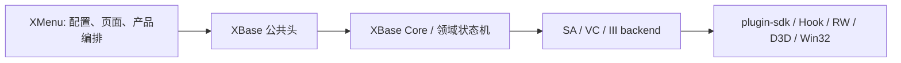

# XBase

XBase 是 GTA SA / VC / III 的底层能力库。

它负责游戏版本后端、plugin-sdk 访问、Hook、渲染、输入、资源、运行时生命周期和平台 I/O；上层产品只应通过 `include/XBase` 中的公共值类型与语义 API 使用它。

## 边界



- 公共头：`include/XBase/*.h`
- 私有实现：`src/`、`src/backends/`
- XMenu 不应包含 XBase 私有源码，不应引用 `../XBase/src`、`../XBase/include` 或 `../XBase/build`。
- `XBaseSA`、`XBaseVC`、`XBaseIII` 必须按游戏版本分别链接，禁止交叉使用。

## 前置条件

- Windows x86 工具链，Visual Studio C++ Desktop Development。
- Premake 5：优先使用 `tools/premake5.exe`。
- plugin-sdk：设置 `PLUGIN_SDK_DIR`，或在相邻目录提供 `../plugin-sdk`。
- 工程固定使用 C++20、Win32/x86、静态运行库。

## 构建

在 XBase 根目录运行：

```bat
Build.bat Release --no-pause
```

也可生成 Debug：

```bat
Build.bat Debug --no-pause
```

`Build.bat` 会重新生成 VS2022 工程并构建以下静态库：

| 库 | 职责 |
| --- | --- |
| `XBaseBootstrap.lib` | 统一加载器入口与 Bootstrap 生命周期。 |
| `XBasePayloadEntry.lib` | Payload DLL 入口，调用 XMenu 的 attach/detach 回调。 |
| `XBaseSA.lib` | GTA San Andreas 后端。 |
| `XBaseVC.lib` | GTA Vice City 后端。 |
| `XBaseIII.lib` | GTA III 后端。 |

Release 产物位于：

```text
build/bin/Release/
```

当相邻的 `../XMenu` 存在时，Release 构建成功后会自动同步：

```text
XMenu/include/XBase/*.h
XMenu/lib/XBaseBootstrap.lib
XMenu/lib/XBasePayloadEntry.lib
XMenu/lib/XBaseSA.lib
XMenu/lib/XBaseVC.lib
XMenu/lib/XBaseIII.lib
```

同步只在全部 Release 目标构建并通过产物核验后执行，不会使用旧库伪造缺失库。

## XMenu 接入

XMenu 应只使用本地 SDK 目录：

```text
XMenu/
├─ include/
│  └─ XBase/
│     └─ *.h
└─ lib/
   ├─ XBaseBootstrap.lib
   ├─ XBasePayloadEntry.lib
   ├─ XBaseSA.lib
   ├─ XBaseVC.lib
   └─ XBaseIII.lib
```

公共头包含方式：

```cpp
#include <XBase/XBase.h>
#include <XBase/Player.h>
```

Payload 必须按目标版本链接对应领域库，并强制包含入口对象：

```lua
libdirs { "lib" }

links { "XBaseSA", "XBasePayloadEntry" }
linkoptions { "/WHOLEARCHIVE:XBasePayloadEntry.lib" }
```

统一加载器链接：

```lua
links { "XBaseBootstrap" }
linkoptions { "/WHOLEARCHIVE:XBaseBootstrap.lib" }
```

`/WHOLEARCHIVE` 是必要的：DLL 入口仅由系统加载时调用，静态链接器不会因为普通符号引用自动选择包含 `DllMain` 的对象文件。

## 配置一致性

- Release XMenu 只能链接 Release XBase 库。
- Debug XMenu 只能链接 Debug XBase 库。
- 不要以 Release 库构建 Debug XMenu，也不要混用 x86/x64 或不同版本的公共头和 `.lib`。
- 更新 XBase 后必须重新构建并同步头文件与库；二者必须来自同一源码版本。

## 能力矩阵

各游戏后端实现的 `Capability` / `FeatureCapability` 支持级别，与 `src/controllers/Capabilities.cpp` 保持一致。

图例：✅ Supported（可用）　◐ Partial（部分可用）　✖ Unsupported（未实现）

### 粗粒度 Capability

| Capability | SA | VC | III |
| --- | :-: | :-: | :-: |
| Player | ✅ | ◐ | ◐ |
| Ped | ◐ | ◐ | ◐ |
| Vehicle | ✅ | ◐ | ◐ |
| Weapon | ✅ | ◐ | ◐ |
| World | ◐ | ◐ | ◐ |
| Visual | ✅ | ◐ | ◐ |
| Teleport | ✅ | ◐ | ◐ |
| Scene | ◐ | ✖ | ✖ |
| Camera | ✅ | ✖ | ✖ |
| Cheats | ✅ | ✖ | ✖ |
| VehicleEffects | ✅ | ✖ | ✖ |
| BulletAssist | ◐ | ◐ | ✖ |
| Hooks | ✅ | ✅ | ✅ |
| Ui | ✅ | ✅ | ✅ |
| Overlay | ◐ | ✖ | ✖ |

### FeatureCapability

#### 玩家 / 行人

| Feature | SA | VC | III |
| --- | :-: | :-: | :-: |
| PlayerBasicState | ✅ | ✅ | ✅ |
| PlayerRuntimeEffects | ✅ | ◐ | ◐ |
| PlayerProofs | ✅ | ✅ | ✅ |
| PlayerMovement | ✅ | ✅ | ✅ |
| PlayerAppearance / Clothes / Stats / SuperJump / SuperPunch / UnderwaterBreathing / CycleJump / NeverHungry / FastSprint / SprintEverywhere / DrunkEffect / NeverWanted / AimSkinChanger / KeepStuff / SaveGame | ✅ | ✖ | ✖ |
| PedBasic / Spawn / Delete / Attributes / Classification | ✅ | ✅ | ✅ |
| PedBigHead | ✅ | ✖ | ✅ |
| PedThinBody / SmokeFlies | ✅ | ✖ | ✖ |
| PedMarkerSpawn / GlobalStrategies | ◐ | ✖ | ✖ |

#### 载具

| Feature | SA | VC | III |
| --- | :-: | :-: | :-: |
| VehicleBasic | ✅ | ◐ | ◐ |
| VehicleColors | ✅ | ◐ | ◐ |
| VehicleDoors / Spawn / SpawnSession / Delete / Events | ✅ | ✅ | ✅ |
| VehiclePopDoors / AlwaysSkidMarks / DisableParticles / DriverTargetable / HeatSeekingTargetable / PetrolTankWeakPoint / SirenOrAlarm / TakeLessDamage / TrafficDensity / AutoDrive / Paintjob / Upgrades / Cheats | ✅ | ✖ | ✖ |

#### 世界

| Feature | SA | VC | III |
| --- | :-: | :-: | :-: |
| WorldTime / Weather / Gravity / GameSpeed / FpsLimit / DaysPassed / FreezeTime / FasterClock / DisableReplay / DisableCheats | ✅ | ✅ | ✅ |
| WorldPickups | ◐ | ◐ | ◐ |
| WorldForbiddenAreaWanted / FreePayNSpray / NoWaterPhysics / SolidWater | ✅ | ✖ | ✖ |

#### 武器 / 传送 / 视觉

| Feature | SA | VC | III |
| --- | :-: | :-: | :-: |
| WeaponBasic / Give / Drop | ✅ | ✅ | ✅ |
| WeaponRuntimeEffects / StatOverrides | ✅ | ✅ | ✅ |
| WeaponSkills | ✅ | ✖ | ✖ |
| TeleportBasic | ✅ | ✅ | ✅ |
| VisualHudRadar / VisualFilter | ✅ | ✅ | ✅ |
| VisualRadarOptions | ✅ | ✖ | ✖ |

#### 场景 / 相机 / 作弊 / 载具特效

| Feature | SA | VC | III |
| --- | :-: | :-: | :-: |
| SceneAnimation / SceneMission | ✅ | ✖ | ✖ |
| SceneParticle / SceneCutscene | ◐ | ✖ | ✖ |
| CameraFreecam / CameraTopDown | ✅ | ✖ | ✖ |
| CheatsRandom | ✅ | ✖ | ✖ |
| VehicleEffectsNeon | ✅ | ✖ | ✖ |

#### BulletAssist

| Feature | SA | VC | III |
| --- | :-: | :-: | :-: |
| BulletAssistTracking / ThroughWalls / PedBounds / VehicleBounds | ✅ | ✅ | ✖ |
| BulletAssistPedCollision / PedSkeleton / VehicleCollision / FireSuppression | ◐ | ◐ | ✖ |

> 说明：以上矩阵由 `Capabilities.cpp` 静态声明，运行时以实际后端行为为准；`Partial` 表示页面/接口可用，但部分动作受限（如 VC/III 的 `WorldPickups` 走脚本指令路径、`PlayerRuntimeEffects` 仅覆盖部分开关）。

## 当前说明

XBase 已提供本地 SDK 的构建与同步流程。XMenu 源码和构建脚本不再依赖 XBase 私有源码路径。

这不代表 XMenu 的 plugin-sdk、D3D、ImGui、kiero 或系统传递链接依赖已经全部清零；该项仍需单独完成并通过三版本实际链接与运行时验证。